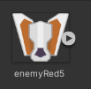
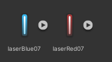
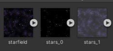
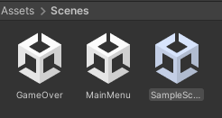
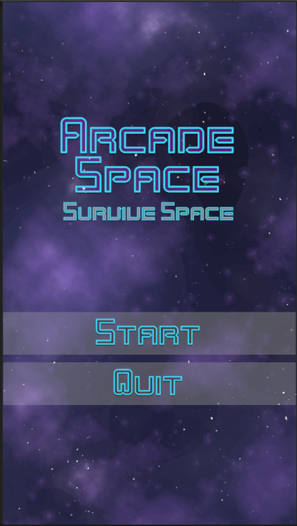
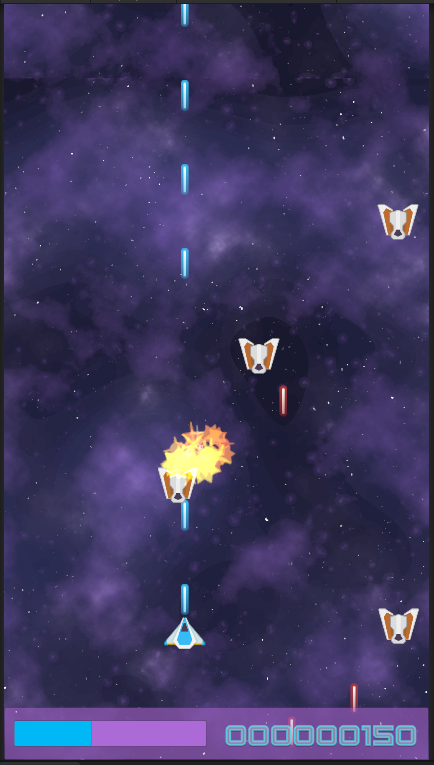
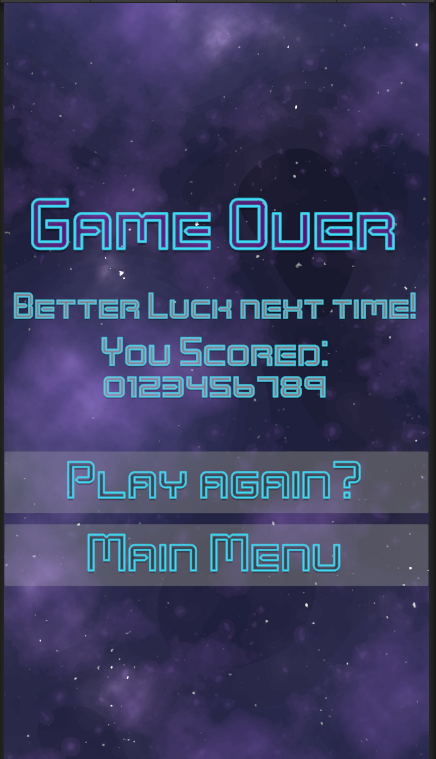
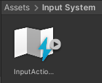
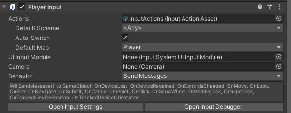

## Final Practice: Arcade game.
## Introduction

The project  is a 2D Arcade space shooter game that provides players with an immersive experience of battling against hordes of enemies in outer space. Players control a spaceship and their primary objective is to survive as long as possible while eliminating enemy ships to earn points.

## Sprites
The first thing that has been done in the search for some sprites. The assets used in the game are sourced from [kenney](https://kenney.nl/) website, which provides free assets for various game genres. One consideration when downloading and utilizing these assets was to ensure the appropriate texture type was used, specifically "Sprite (2D and UI)" for this particular case, these are the sprites used for this project:
 
      
 
 
## Scenes

 

This game is divided into three screens. The game starts with the Main Menu screen, where players have the option to start the game or quit. When the start button is pressed, the game transitions to a new screen the gameplay screen. In this screen, players control a blue ship and their objective is to dodge enemy bullets and destroy enemy ships to earn points. When the player's ship is destroyed, the game moves to the "Game Over" screen. In this screen, players have the option to play again or return to the main menu. The "Game Over" screen displays the player's total score and a message.

In the gameplay screen, the player controls the blue ship while trying to avoid enemy projectiles and eliminate enemies for points. The game features visually appealing projectiles and particle effects that are generated upon collision with enemies. The enemies appear in waves, adding to the challenge. The UI at the bottom of the screen displays the player's remaining lives and score. The game consists of a single level with infinite waves of enemies, allowing players to earn points until they run out of lives and the game ends.

The primary focus during the game's development was to ensure smooth player movement, enemy behavior, and balancing the player's life. Additionally, shooting mechanics were implemented for the player, and enemies were given their own life and scoring system. Visual effects and sound effects were added to enhance the overall experience. Various menu screens were also designed to improve the game's usability.

    

## Input System
To implement player controls, the new Unity Input System was utilized. The Input System package was installed via the Unity Package Manager. This system provides the ability to create custom actions for the player controls. By adding the Input System as a component to the player, default actions such as movement and shooting were already defined. To incorporate the Input System, the Player script was created. This script utilizes the InputSystem to detect player input and subsequently updates the player's movement and animation based on the input received.

 

 

 

## Player
To manage the player's behavior, we created the "Player" script. In this script, we declare and initialize several variables and fields, including movement speed, padding values, input vectors, boundary vectors, and a reference to a Shooter component.

In the Awake() method, we retrieve the Shooter component attached to the same GameObject as the Player script.

In the Start() method, we call the InitBounds() function to initialize the boundaries of the play area based on the camera's viewport.

In the Update() method, we call the Move() function to handle the player's movement.

The InitBounds() function uses the Camera.main reference to calculate the minimum and maximum world positions based on the camera's viewport. This ensures that the player remains within the defined boundaries.

The Move() function calculates the player's movement based on the raw input vector, movement velocity, and the elapsed time since the last frame. It applies the motion within the specified bounds, considering the padding values.

The OnMove() function serves as an event handler triggered by input from the player's movement controls. It updates the rawInput vector accordingly.

The OnFire() function is an event handler triggered by input from the player's firing controls. It sets the "isFiring" flag of the Shooter component based on the state of the input value (pressed or not pressed).

In summary, the Player script manages the player's behavior by handling input, updating movement and animations, and ensuring the player stays within the defined bounds. Additionally, it controls the firing behavior through the Shooter component.
