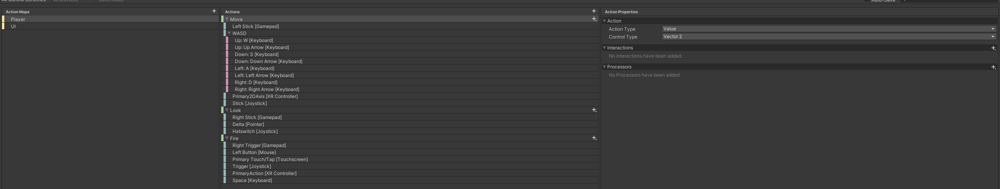
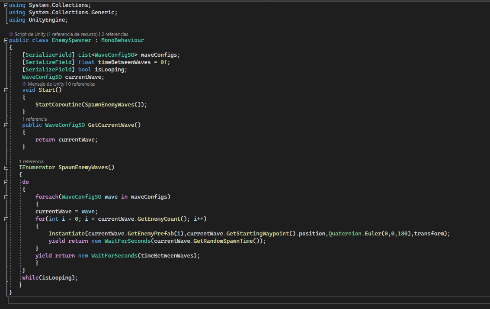

## Final Practice: Arcade game.
## Introduction

The project  is a 2D Arcade space shooter game that provides players with an immersive experience of battling against hordes of enemies in outer space. Players control a spaceship and their primary objective is to survive as long as possible while eliminating enemy ships to earn points.

## Sprites
The first thing that has been done in the search for some sprites. The assets used in the game are sourced from [kenney](https://kenney.nl/) website, which provides free assets for various game genres. One consideration when downloading and utilizing these assets was to ensure the appropriate texture type was used, specifically "Sprite (2D and UI)" for this particular case, these are the sprites used for this project:
 
      
 
 
## Scenes

 

This game is divided into three screens. The game starts with the Main Menu screen, where players have the option to start the game or quit. When the start button is pressed, the game transitions to a new screen the gameplay screen. In this screen, players control a blue ship and their objective is to dodge enemy bullets and destroy enemy ships to earn points. When the player's ship is destroyed, the game moves to the "Game Over" screen. In this screen, players have the option to play again or return to the main menu. The "Game Over" screen displays the player's total score and a message.

In the gameplay screen, the player controls the blue ship while trying to avoid enemy projectiles and eliminate enemies for points. The game features visually appealing projectiles and particle effects that are generated upon collision with enemies. The enemies appear in waves, adding to the challenge. The UI at the bottom of the screen displays the player's remaining lives and score. The game consists of a single level with infinite waves of enemies, allowing players to earn points until they run out of lives and the game ends.

The primary focus during the game's development was to ensure smooth player movement, enemy behavior, and balancing the player's life. Additionally, shooting mechanics were implemented for the player, and enemies were given their own life and scoring system. Visual effects and sound effects were added to enhance the overall experience. Various menu screens were also designed to improve the game's usability.

    

## Input System
To implement player controls, the new Unity Input System was utilized. The Input System package was installed via the Unity Package Manager. This system provides the ability to create custom actions for the player controls. By adding the Input System as a component to the player, default actions such as movement and shooting were already defined. To incorporate the Input System, the Player script was created. This script utilizes the InputSystem to detect player input and subsequently updates the player's movement and animation based on the input received.

 

 

 

## Player
To manage the player's behavior, we created the "Player" script. In this script, we declare and initialize several variables and fields, including movement speed, padding values, input vectors, boundary vectors, and a reference to a Shooter component.

 

 

In the Awake() method, we retrieve the Shooter component attached to the same GameObject as the Player script.

In the Start() method, we call the InitBounds() function to initialize the boundaries of the play area based on the camera's viewport.

In the Update() method, we call the Move() function to handle the player's movement.

The InitBounds() function uses the Camera.main reference to calculate the minimum and maximum world positions based on the camera's viewport. This ensures that the player remains within the defined boundaries.

The Move() function calculates the player's movement based on the raw input vector, movement velocity, and the elapsed time since the last frame. It applies the motion within the specified bounds, considering the padding values.

The OnMove() function serves as an event handler triggered by input from the player's movement controls. It updates the rawInput vector accordingly.

The OnFire() function is an event handler triggered by input from the player's firing controls. It sets the "isFiring" flag of the Shooter component based on the state of the input value (pressed or not pressed).

## Enemies and Waves
The enemies primarily inflict damage to the player, can have different attack behaviors, affect the player's score, and appear in waves. To facilitate this, I created a scriptable object that specifies which enemies appear, the path they should follow, and the time between different waves.

 

 

We use waypoints for the different waves. In this case, two different routes were established for the waves

 

 

In the "WaveConfigSO" scriptable object, is responsible for defining the enemies that appear in waves. It includes information about enemy prefabs, movement speed, spawn timings, and waypoints. The provided methods allow easy access to these values for gameplay implementation.
The script is marked with the [CreateAssetMenu] attribute, allowing instances of this scriptable object to be created from the Unity editor's "Create" menu. It specifies the menu name and file name for the created asset.

The class declares and serializes several fields:

    "enemyPrefabs": a list of GameObjects representing the enemy prefabs to be spawned in the wave.
    "pathPrefab": a Transform representing the path or waypoints that the enemy objects will follow.
    "moveSpeed": a float indicating the movement speed of the enemies.
    "timeBetweenEnemySpawns": a float specifying the time delay between each enemy spawn.
    "spawnTimeVariance": a float determining the random variance in the spawn time of enemies.
    "minimumSpawnTime": a float indicating the minimum time between enemy spawns.

The "GetEnemyCount()" method returns the number of enemy prefabs in the "enemyPrefabs" list.

The "GetEnemyPrefab(int index)" method retrieves a specific enemy prefab from the "enemyPrefabs" list based on the given index.

The "GetStartingWaypoint()" method returns the first child transform of the "pathPrefab" as the initial waypoint for enemy movement.

The "GetWaypoints()" method retrieves and returns a list of all child transforms of the "pathPrefab" representing the waypoints for enemy movement.

The "GetMoveSpeed()" method provides the movement speed of the enemies.

The "GetRandomSpawnTime()" method calculates and returns a random spawn time for enemies within the specified time range, taking into account the spawn time variance. It ensures that the spawn time is not below the minimum spawn time.

Additionally, we created the following code and named it "Pathfinder". This script is responsible for controlling the movement of enemies along the specified path:

In this script, we have a reference to the EnemySpawner component and a WaveConfigSO variable to retrieve the current wave's configuration. We also store a list of waypoints retrieved from the wave configuration.

During the Start() method, we set the initial position of the enemy object to the first waypoint's position.

The FollowPath() method is responsible for moving the enemy object along the path. It checks if there are waypoints remaining to follow. If so, it calculates the target position, determines the movement delta based on the wave's move speed, and moves the enemy object towards the target position using Vector2.MoveTowards(). If the enemy reaches the target position, the waypoint index is incremented to move to the next waypoint. If there are no more waypoints, the enemy object is destroyed.

Overall, the Pathfinder script enables enemies to navigate along a predefined path by following a series of waypoints provided by the wave configuration.

Finally the script called "EnemySpawner". This script is responsible for spawning enemy waves based on the specified wave configurations:

 We have a list of WaveConfigSO objects representing different wave configurations, which are serialized in the Unity inspector. We also have variables for the time between waves and a boolean flag indicating whether the waves should loop.

During the Start() method, we start the coroutine SpawnEnemyWaves() to begin spawning enemy waves.

The GetCurrentWave() method is used to retrieve the current wave configuration.

The SpawnEnemyWaves() coroutine is responsible for spawning enemy waves based on the configured wave data. It uses a do-while loop to allow for looping waves if isLooping is set to true. Inside the loop, it iterates through each wave configuration, sets the currentWave variable, and spawns the enemies. The enemies are instantiated based on the enemy prefabs from the current wave configuration, using the starting waypoint position as the spawn position. A random spawn time is applied between each enemy spawn. After all enemies have been spawned, the coroutine waits for the specified timeBetweenWaves before moving to the next wave.

Overall, the EnemySpawner script controls the spawning of enemy waves based on the provided wave configurations, allowing for flexible and customizable enemy spawning in the game.

## Damage
To address the damage issue for the player and the enemies, we made the following adjustments:

   Added a 2D Rigidbody component We attached a Rigidbody component to the GameObject. This allows us to apply physics-based movements and interactions.

   Added a Circle Collider component: We included a Circle Collider component to the player GameObject. We adjusted the collider size to match the size of the sprite.
   
   
   
   Created a Health script:  is responsible for managing the health of a game object, which can be either the player or other entities. 
   
     
   
   Here's a breakdown of what the code does:

   Serialized Fields: The script includes several serialized fields that can be set in the Unity Inspector. These fields include:
   
       "isPlayer": A boolean flag indicating whether the game object is the player.
       
       "health": An integer representing the initial health value of the game object.
       
       "score": An integer representing the score value associated with the game object (used when the game object is not the player).
       
       "hitEffect": A ParticleSystem that plays a visual effect when the game object takes damage.
       
       "applyCameraShake": A boolean flag indicating whether to apply camera shake when the game object takes damage.

   Component References: In the "Awake" method, the script retrieves references to various components and managers needed for gameplay. These include:
   
        "cameraShake": A reference to the CameraShake script attached to the main camera.
        
        "audioPlayer": A reference to the AudioPlayer script responsible for playing audio clips.
        
        "scoreKeeper": A reference to the ScoreKeeper script, which manages the player's score.
        
        "levelManager": A reference to the LevelManager script, used to load the game over screen.

   OnTriggerEnter2D: This method is called when the game object's collider enters a trigger collider on another object. It checks if the colliding object has a "DamageDealer" component attached to it.
        If a "DamageDealer" component is found, the script proceeds to:
        
            Call the "TakeDamage" method, passing the damage value from the "DamageDealer" component.
            
            Play the hit effect particle system.
            
            Play the damage audio clip.
            
            Trigger camera shake.
            
            Call the "Hit" method on the "DamageDealer" component, indicating that it successfully hit the game object.

   TakeDamage: This method is responsible for reducing the game object's health by the specified damage amount.
   
        It subtracts the damage from the current health value.
        
        If the health reaches or falls below zero, the "Die" method is called.

   Die: This method is called when the game object's health reaches zero or below.
   
        If the game object is not the player, it modifies the score by the specified value.
        
        If the game object is the player, it calls the "LoadGameOver" method on the level manager to handle the game over scenario.
        
        Finally, it destroys the game object.

   PlayHitEffect: This method instantiates the hit effect particle system at the position of the game object.
   
        The instantiated particle system is destroyed after its duration and maximum lifetime.

   ShakeCamera: This method triggers the camera shake effect if the "applyCameraShake" flag is enabled and a CameraShake component is present on the main camera.

  Created a DamagedDealer script: Is responsible for determining the damage value of an object and destroying it upon impact.
  
  
  
  Here's a breakdown of what the code does:
  
   Serialized Field: The script includes a serialized field named "damage." This field represents the amount of damage the object can deal and can be set in the Unity Inspector.

   GetDamage: This method allows other scripts to retrieve the damage value specified for the object.
   
           It simply returns the value stored in the "damage" field.

   Hit: This method is called when the object is hit or impacted by something.
   
        It destroys the game object to which the script is attached using the Destroy function.
            The Destroy function removes the object from the scene, freeing up memory resources.
            
## Shooting
With regards to shooting for both enemies and the player, a prefab has been created for each sprite, as mentioned earlier in the document. For the projectiles, a 2D Rigidbody and a 2D Capsule Collider have been added to represent their shape and allow them to act as triggers. Additionally, the DamageDealer script has been included. To distinguish between the player and enemy projectiles, two layers have been created—one for the player and another for the enemy. By assigning the appropriate layers, both the ships and projectiles will have their own designated layers.

To enable the player to shoot, the Input System was implemented, specifically utilizing the space bar as the trigger input for shooting actions. This allows the player to initiate projectile firing when the space bar is pressed.
